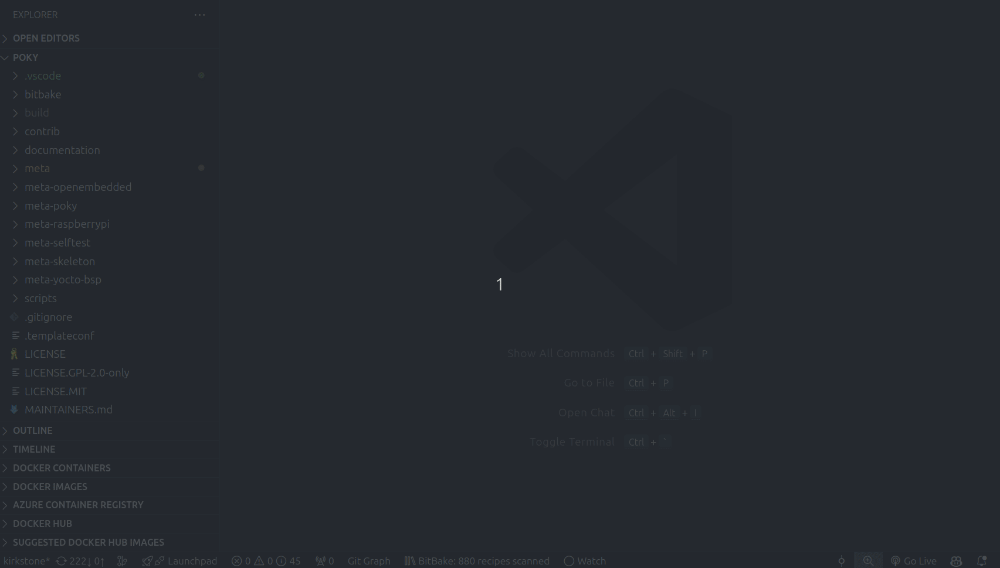

# MoCommander README

MoCommander is a VS Code extension that provides custom command functionalities to enhance your development workflow.

## Features

- **Add Command**: Easily add custom commands to your workflow.
- **Execute Command**: Execute predefined commands with a single click.

> Tip: Utilize animations to demonstrate your extension's features effectively.

## Requirements

- Visual Studio Code version 1.96.0 or higher.

## Extension Settings

This extension contributes the following settings:

* `moCommander.enable`: Enable/disable this extension.
* `moCommander.thing`: Set to `blah` to do something.

## Known Issues

- No known issues at the moment.

## Release Notes

### 0.0.1

- Initial release of MoCommander.

---

## Following Extension Guidelines

Ensure that you've read through the extension guidelines and follow the best practices for creating your extension.

* [Extension Guidelines](https://code.visualstudio.com/api/references/extension-guidelines)

## Working with Markdown

You can author your README using Visual Studio Code. Here are some useful editor keyboard shortcuts:

* Split the editor (`Cmd+\` on macOS or `Ctrl+\` on Windows and Linux).
* Toggle preview (`Shift+Cmd+V` on macOS or `Shift+Ctrl+V` on Windows and Linux).
* Press `Ctrl+Space` (Windows, Linux, macOS) to see a list of Markdown snippets.

## For More Information

* [Visual Studio Code's Markdown Support](http://code.visualstudio.com/docs/languages/markdown)
* [Markdown Syntax Reference](https://help.github.com/articles/markdown-basics/)

**Enjoy!**
